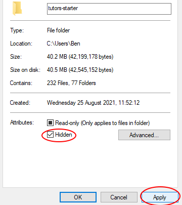
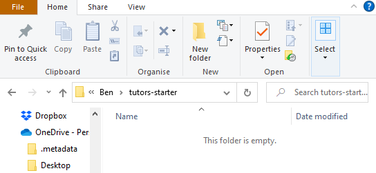
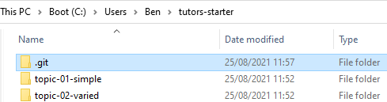

# Clone a Template Course

1. Open GitHub Desktop and select `File` -> `Clone Repository`

2. Switch to the `URL` tab and enter the following:

~~~
https://github.com/tutors-sdk/tutors-starter.git
~~~

3. Open your `File Explorer`, and follow this path:
    
4. `Right click` some blank space in the file explorer window and select `Properties`.
    
5. At the bottom of the pane, there is a checkbox labelled `Hidden`, check this box then select `Apply`.    
    
6. Press `Ok` when prompted.     
    
7. You will notice the files disappear.    
    
8. Deselect the `Hidden` checkbox and select `Apply`, then confirm again with `Ok`.     
    
9. You will notice a `.git` folder has appeared. This folder links the `tutors-starter` folder to the remote repository it was cloned from. We must break this link so you can connect it to your own remote repository.
    

10. `Delete` the `.git` folder. 

11. Open the `.gitignore` file and remove the following line before saving the file:

~~~
json
~~~ 