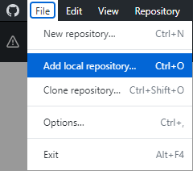
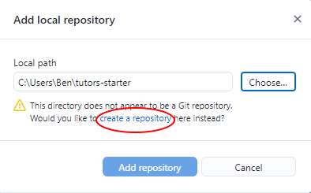
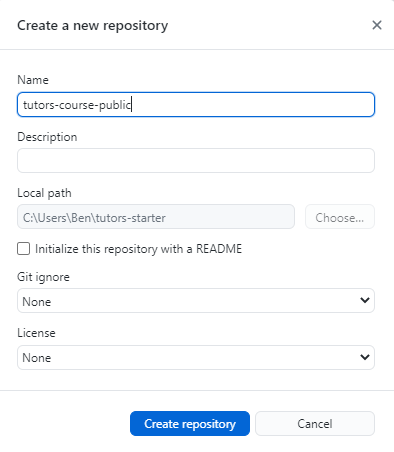
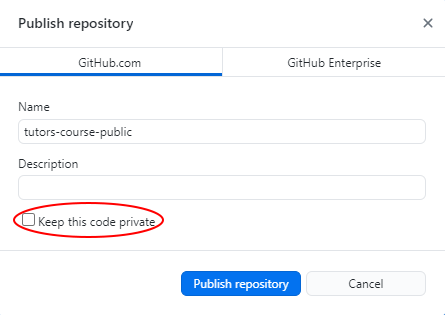

# Create a New Remote Repository

1. In Git Desktop, Navigate to `File` -> `Add local repository..`.

    

2. Select `Choose`, then navigate to your `tutors-starter` folder at this path:

    

2. As the folder is not linked to a remote repository, you will be prompted to `Create a New Repository`. Select this link:

    

3. Enter `tutors-course-public` as the repository name and select `Create Repository`. You can name the repository whatever you like, but make sure to use the same name consistantly throughout.

    

4. Enter the name from the previous step once again, then deselect the `Keep this code private` box, and click `Publish repository`.  

      

You now have a file structure stored in a remote repository on GitHub which will be used by Netlify to generate and deploy the course website.

In the next step you will set up Netlify and deploy your tutors course website.