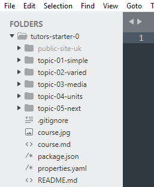
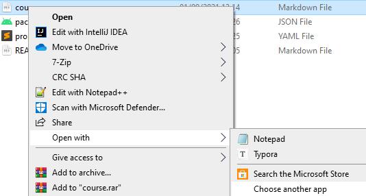

# Sublime

1. To format your course content, you will be using the simple `Markdown notation`. `Sublime Text` is an excellent editor with automatic language recognition, keyword highlighting, and file structure layout. Follow this link and select `Download for Windows`.

2. Once installed, open Sublime Text. You may need to search by pressing the `Windows key`, then typing `Sublime`.

  

3. Select `Sublime` from the search results. 

  

4. In Sublime, select `File` -> `Open Folder..`.

  

5. When prompted, select `This PC` -> `Boot` -> `Users` -> `Your Name`.

  

6. Click the `tutors-starter` folder, then the `Select Folder` button. Note the sidebar which provides a convenient view of the file structure.

  

7. To set Sublime as your default editor for `Markdown` files, navigate to your `tutors-starter` folder in `File Explorer`, then `Right Click` any `Markdown` file and select `Open With..` -> `Choose another app`

    

8. The following window will appear, select `More apps`:

    

9. Scroll down and select `Sublime Text`, also check the box labelled `Always use this app to open .md files`, then select `OK`.

    

You will notice that the icon representing `.md` files is now the Sublime Text logo. This means Sublime is your default Markdown file editor.

       