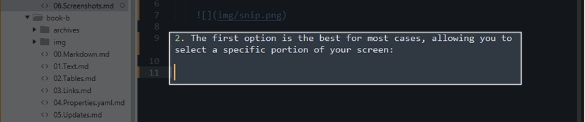
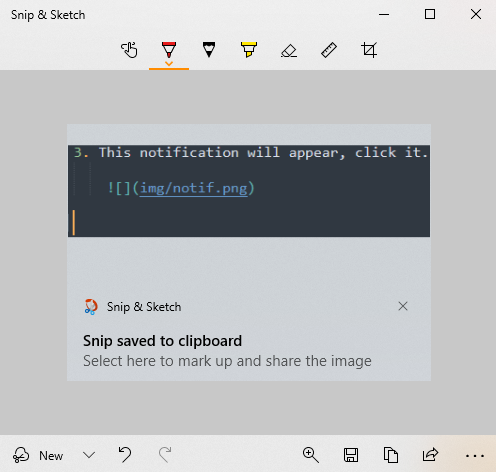

# Capturing Screenshots

Windows 10 has a pre-installed screen capture tool which allows you to capture specific sections, or the whole screen.

1. Press shift + windows key + s, The screen will dim and this bar will appear at the top-center of your screen.

    

2. The first option is the best for most cases, allowing you to select a specific portion of your screen:

    

3. This notification will appear, click it.

    

4. The clipboard will appear, where you can draw, highlight, and further crop the image, before saving via the floppy disk icon.

    