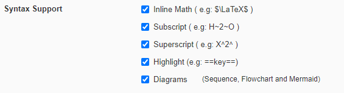

# Typora

This step is **optional**. If you are happy using Sublime, continue to the next step.

Be Aware: Typora is currently free while in Beta testing, however this will change with the release of the official version.

Some features of Typora are not currently compatible with Tutors but are being integrated over time. These are the additional functionality mentioned below.

Typora adds additional functionality to the Markdown notation, such as `Highlighting`, `Diagrams`, `Maths`, `Emoji's`, and `Diagrams`. Unlike other editors, Typora is a Markdown only editor, meaning other files such as `properties.yaml` cannot be edited with this application.

However, Typora is unique, allowing the user to view how the content they are writing in Markdown will look through a browser, as they write it. This greatly reduces the time required for testing page formatting. 

  

To view the code which is in effect, just click the area which has been formatted. For example: `Be Aware` is red due to a `` tag, click the effected area to see the `` tag which is in effect.

  

---

# Installation

1. Follow this link and select the operating system you are using:

    - [Typora Download](https://typora.io/#download)

     

2. `Install` the application and launch it. 

3. Select `File` -> `Open Folder..`, then select the `tutors-starter` folder.  

   

   

4. You should see the folder structure open in the sidebar to the left. If the side bar is a list rather than a tree, select this option at the bottom of the sidebar:

     

5. Select `File` -> `Preferences`

   

6. Select `Markdown` from the options provided:

   

   

7. `Enable` each of the following options: 

   

