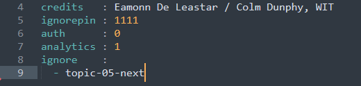
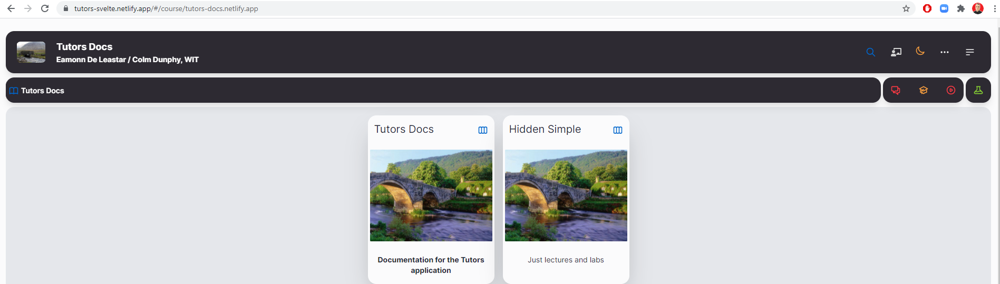

# Properties.yaml

1. Navigate to the `properties.yaml` file in your sites root directory (`tutors-starter` folder)

    

2. Edit the `credits` section to include your name.

    

3. Take note of the `ignore` and `ignorepin` section. These allow you to hide course content from students. To show the folder, simply enter the pin on the frontpage of your course site, remove the folder name from the `ignore` section, or use this syntax: (The `#` symbol indicates the topic is shown. Remove the `#` to hide the topic.)

    ~~~html
    ignorepin : 1111
    ignore    : 
    # - topic-01-docs
     - topic-05-hidden
    ~~~ 

4. In this example, the pin is `1111`. If `1111` is typed into the keyboard while on the front page of the website, and while the site is your current window, the hidden course content will be enabled.

    
    

 

# Lab File Names

1. Lab file names and titles control the output displayed in breadcrumbs and lab pages. Study the following image to see how these correspond:

    

2. The filename controls the breadcrumb output at the lab level, while the file title controls the page title on the sidebar and in the page content itself.         

3. The correct syntax for a filename is `2 digit` step number - `YourWord` - `.md`:

    ~~~html
    00.Markdown.md
    ~~~ 

4. These files are where you use Markdown to layout your lab steps.    
