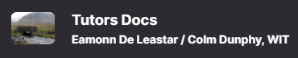
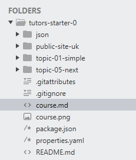
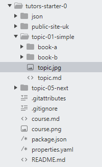
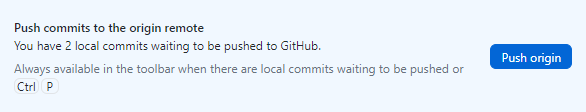
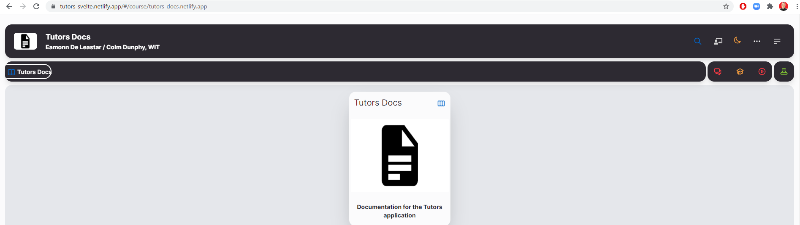

# Making Changes

1. Navigate to the front page of your course site, take note of the icon in the top left of the screen.

    

2. This image can be changed by replacing the `course.png` file in the root directory (`tutors-starter` folder). If you replace the course image, you must make sure to name it `course` with the `.jpg` or `.png` file extension.   

    

3. The course description and name can be edited via the `course.md` file, located in the `tutors-starter-0` folder.

      

4. Navigate to `topic-01-simple` and notice the `topic.md` and `topic.jpg` files. As with the previous steps, these can be edited and replaced with your own, and correlate to the topic they are stored in. If you replace the topic image, you must make sure to name it `topic` with the `.jpg` or `.png` file extension.

    

5. Finally, navigate into either `book-a` or `book-b`. These are both lab folders and contain `img` and `archives` folders.

    

6. The `img` folder is where any images you need to include in lab content must be stored.

    

7. The `archives` folder, located within a `book-*` folder is where any `.zip` `.rar` `.tar.gz` type files must be stored. These archive files can then be linked to students for download.

    - [Solution Archive](archives/docs.zip)

    ~~~html
    - [Solution Archive](archives / docs.zip) Remove the spaces, these are to show you can use a relative path.
    - [Solution Archive](archives/docs.zip) Markdown automatically adds the absolute path.
    ~~~

8. For any change to take effect, you must open GitHub Desktop and enter a summary of your changes with an optional description.

9. Press `Commit to main`. This will push updates from your local machine, into staging, ready to be pushed into the remote repository.

    

10. Now select `Push origin` to synchronise your local and remote repositories.

    

11. Netlify will automatically update your website with the changes pushed to the remote repository.

12. Open your course site in a browser and refresh the page. This may take ~30 secs, hold the `Shift` key and refresh the page to clear the page cache.

    
You should now be able to experiment, using this guide to build your course as you like.
