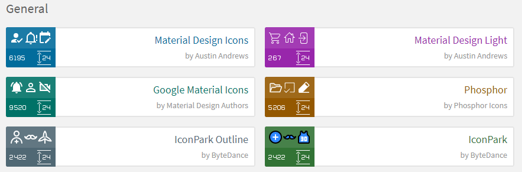
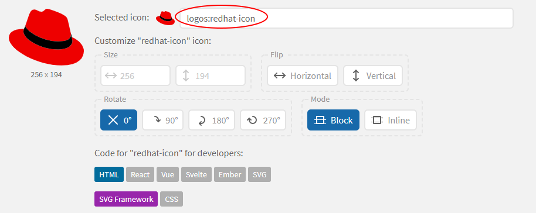
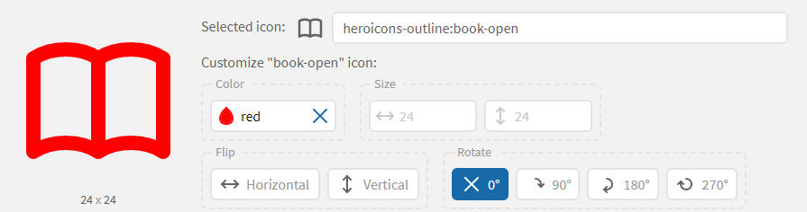

# Changing Card Icons

- To change the image on each `Course` or `Topic` card to be uniform, and easily configurable, follow the steps below:

    

1. Navigate to [Iconify](https://icon-sets.iconify.design/).

2. These are packs of icons which are fully compatible with Tutors. Select the pack you want to use:

    

3. Then select the `icon` which you want to use:

    

4. This opens the icon details section. Copy the icon name:

    

5. Open `course.md` or `topic.md`, then copy this template into the top of the file, above the title, and replace `logos:redhat-icon` with the icon name from Iconify:
    ~~~
    ---
    icon:
      type: logos:redhat-icon
    ---
    ~~~

6. Some icons can be changed colour (The color picker on the website does not dictate the color, but is a clue as to which icons can be customised):

    

    ~~~
    ---
    icon:
      type: heroicons-outline:book-open
      color: red
    ---   
    ~~~ 