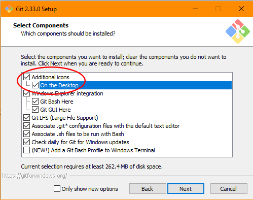
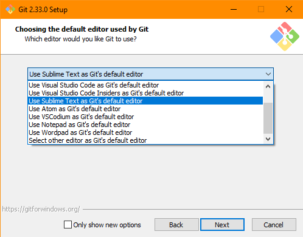
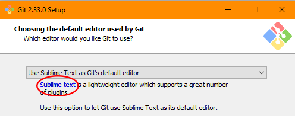
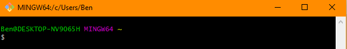

## Git Bash and Sublime

1. Follow this link and select the operating system you are using:

  - [Git Bash Download](https://git-scm.com/downloads)  

2. When the download is complete, run the program and click **Next** to accept the license agreement.  

3. Check the **On the Desktop** box, under **Additional icons**, then click **Next**

  

4. Select **Use Sublime Text as Git's default editor** from the dropdown menu. This will disable the **Next** button if you don't already have Sublime installed. You will also notice a blue link beneath the dropdown menu.

  
  

5. Click this link. You will be redirected to the Sublime Text website where you will select the **Download for Windows / Mac** button.   

  

6. If the **Next** button isn't automatically enabled, select **Back** then continue selecting **Next** until the installation begins.  

7. When the installation is complete, check the **Launch Git Bash** box and click **Finish**.   

8. A terminal window similar to this will appear.

  

9. You must now set up your Git credentials. To do this, type the following commands, one by one, into the terminal, replacing the name and email address with your own. (Quotation marks should be included)

 ~~~   
  git config --global user.name "John Doe"

  git config --global user.email johndoe@example.com  
 ~~~