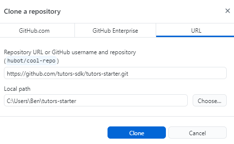
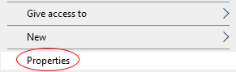

# Clone a Template Course

1. Open GitHub Desktop and select **File** -> **Clone Repository**

2. Switch to the **URL** tab and enter the following:

~~~
https://github.com/tutors-sdk/tutors-starter.git
~~~

3. Open your File Explorer, and follow this path:

    - **This PC** -> **Boot** -> **Users** -> **Your Name** -> **tutors-starter**

4. **Right click** some blank space in the file explorer window and select **Properties**. At the bottom of the pane, there is a checkbox labelled **Hidden**, check this box and press **Ok** when prompted. You will notice the files disappear. Deselect the **Hidden** checkbox and select **OK** again.

    
    
    
    
    

You will notice a **.git** folder has appeared. This folder links the **tutors-starter** folder to the remote repository it was cloned from. We must break this link so you can connect it to your own remote repository.
    

5. **Delete** the **.git** folder. 

6. Open the **.gitignore** file and remove the following line before saving the file:

~~~
json
~~~ 

# Create a New Remote Repository

1. Navigate back a folder to **This PC** -> **Boot** -> **Users** -> **Your Name** and drag the **tutors-starter** folder, into the **GitHub Desktop** application.

2. As the folder is not linked to a remote repository, you will be prompted to **Create a New Repository**. Select this link:

3. Enter tutors-course-public as the repository name and select **LOOKUP**

You now have a file structure stored in a remote repository on GitHub which will be used by Netlify to generate and deploy the course website. 

In the next step you will set up Netlify and make a change to the website. The site will be automatically updated as you push changes made on your local machine to the remote repository on GitHub, as you did in the previous step.