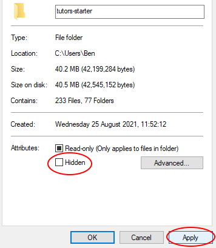

# Clone a Template Course

1. Open GitHub Desktop and select **File** -> **Clone Repository**

2. Switch to the **URL** tab and enter the following:

~~~
https://github.com/tutors-sdk/tutors-starter.git
~~~

3. Open your File Explorer, and follow this path:
    
4. **Right click** some blank space in the file explorer window and select **Properties**.
    
5. At the bottom of the pane, there is a checkbox labelled **Hidden**, check this box then select **Apply**.    
    
6. Press **Ok** when prompted.     
    
7. You will notice the files disappear.    
    
8. Deselect the **Hidden** checkbox and select **Apply**, then confirm again with **Ok**.     
    
9. You will notice a **.git** folder has appeared. This folder links the **tutors-starter** folder to the remote repository it was cloned from. We must break this link so you can connect it to your own remote repository.
    

10. **Delete** the **.git** folder. 

11. Open the **.gitignore** file and remove the following line before saving the file:

~~~
json
~~~ 

# Create a New Remote Repository

1. In Git Desktop, Navigate to **File** -> **Add Local Repository**.

    

2. Select **Choose**, then navigate to your **tutors-starter** folder at this path:

    

2. As the folder is not linked to a remote repository, you will be prompted to **Create a New Repository**. Select this link:

    

3. Enter tutors-course-public as the repository name and select **Create Repository**. You can name the repository whatever name you like, but make sure to use the same name consistantly throughout.

    

4. Enter the name from the previous step once again, then deselect the **Keep this code private** and click **Publish repository**.  

      

You now have a file structure stored in a remote repository on GitHub which will be used by Netlify to generate and deploy the course website. 

In the next step you will set up Netlify and make a change to the website. The site will be automatically updated as you push changes made on your local machine to the remote repository on GitHub, as you did in the previous step.