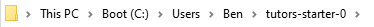
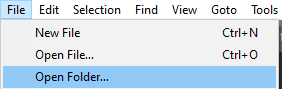
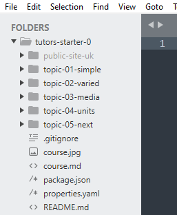

# Netlify

1. Follow this link and login via GitHub:
    - [Login to Netlify](https://netlify.com)
2. Select **New site from Git**

3. Under Continuous Deployment, select **GitHub** as your Git provider.

4. Under **Basic build settings**, enter the following:  **Build command:**
  ~~~
  tutors-json
  ~~~
    **Publish directory:**
  ~~~
  json
  ~~~

5. Select **Deploy Site**

Netlify will build your website and set the status of the deploy to **Published**.

6. Select the **Domain settings** button and scroll down to the **Domains** section.

7. Click the **Dropdown Options** button and select **Edit site name**.

8. Enter the desired domain name for your Tutors site and click **Save**

9. Your site is now setup, click the link shown here to have a look.

# Sublime Folder Setup  

7. Open Sublime Text. You may need to search by pressing the **Windows key**, then typing **Sublime**.

  

8. Select **Sublime** from the search results. 

  

9. In Sublime, select **File** -> **Open Folder..**. When prompted, select **This PC** -> **Boot** -> **Users** -> **Your Name** -> Click **tutors-starter**, then the **Select Folder** button. Note the sidebar which provides a convenient view of the file structure.

  

  

  