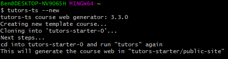
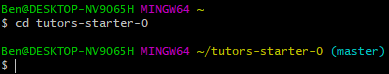
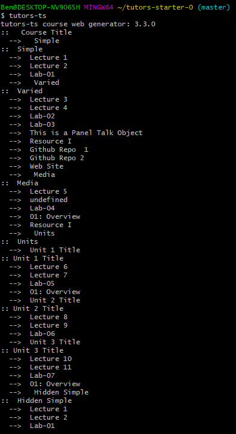
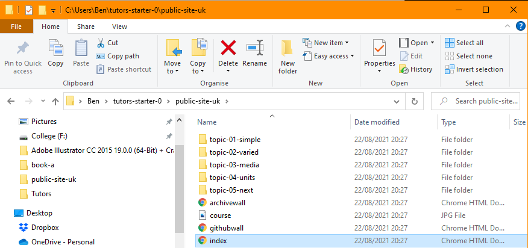

# Netlify

1. Open the Git Bash terminal and type the following command: (This will take a couple of minutes, don't worry if it seems stuck.)

  ~~~
  npm install tutors-ts -g
  ~~~

2. When the installation completes you will see a line similar to this: (Although the version number may differ)

  ~~~
  + tutors-ts@3.3.0
  ~~~

3. Generate a template course by typing the following command into the Git terminal: (This generates a folder named **tutors-starter-0** which contains the sample files to be replaced with your own later)

  ~~~
  tutors-ts --new
  ~~~
  
  

4. The command to change directory is **cd (option)** use this to navigate into the tutors-starter-0 folder. (Git Bash uses **Users** -> **Your Name** as its root directory.)

  ~~~
  cd tutors-starter-0
  ~~~
  

5. Now enter the following command, which generates the course website content from the file structure within **tutors-starter-0** and populates a new folder named **public-site-uk**.

  ~~~
  tutors-ts
  ~~~
  

6. Navigate to **public-site-uk** in Windows Explorer and open the index.html file. This is your course website, hosted locally.        
  
  

# Sublime Folder Setup  

7. Open Sublime Text. You may need to search by pressing the **Windows key**, then typing **Sublime**.

  

8. Select **Sublime** from the search results. 

  

9. In Sublime, select **File** -> **Open Folder..**. When prompted, select **This PC** -> **Boot** -> **Users** -> **Your Name** -> Click **tutors-starter-0**, then the **Select Folder** button. Note the sidebar which provides a convenient view of the file structure.

  

  

  