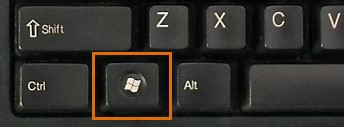

# Sublime

1. To format your course content, you will be using the simple **Markdown notation**. An excellent editor with automatic language recognition, keyword highlighting, and file structure layout, is **Sublime Text**. Follow this link and select **Download for Windows**.

2. Open Sublime Text. You may need to search by pressing the **Windows key**, then typing **Sublime**.

  

3. Select **Sublime** from the search results. 

  

4. In Sublime, select **File** -> **Open Folder..**. When prompted, select **This PC** -> **Boot** -> **Users** -> **Your Name** -> Click **tutors-starter**, then the **Select Folder** button. Note the sidebar which provides a convenient view of the file structure.

  

  

  
