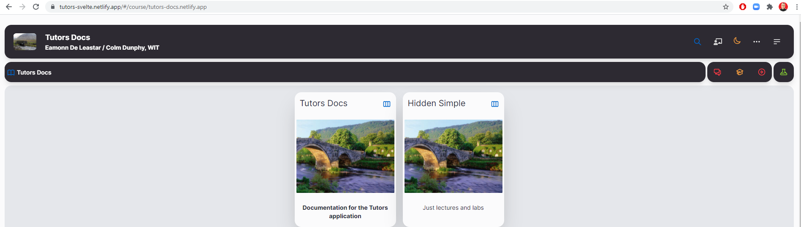
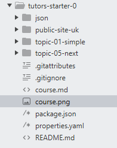
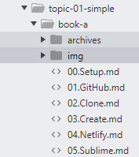

# Properties.yaml

1. Navigate to the `properties.yaml` file in your sites root directory (`tutors-starter` folder)

    

2. Edit the `credits` section to include your name.

    

3. Take note of the `ignore` and `ignorepin` section. These allow you to hide course content from students. To show the folder, simply enter the pin on the frontpage of your course site, or remove the folder name from the `ignore` section.

4. In this example, the pin is `1111`. If `1111` is typed into the keyboard while on the front page of the website, and while the site is your current window, the hidden course content will be enabled.

    

5. While on the front page of the site, take note of the icon in the top left of the screen.

    

6. This image can be changed by replacing the `course.png` file in the root directory (`tutors-starter` folder). If you replace this image, you must make sure to name it `course` with the `.png` file extension.   

    

7. The course description and name can be edited via the `course.md` file, located in the `tutors-starter-0` folder, as with `course.png`.

      

8. Navigate to `topic-01-simple` and notice the `topic.md` and `topic.jpg` files. As with the previous steps, these can be edited and replaced with your own, and correlate to the topic they are stored in. If you replace the topic image, you must make sure to name it `topic` with the `.jpg` file extension.

    

9. Finally, navigate into either `book-a` or `book-b`. These are both lab folders and contain `img` and `archives` folders.

    

10. The `img` folder is where any images you need to include in lab content must be stored.

    

11. The `archives` folder is where any `.zip` `.rar` `.tar.gz` type folders should be stored. These archive files can then be linked to students for download.

    - [Solution Archive](archives/docs.zip)

    `- [Solution Archive](archives/docs.zip)`

