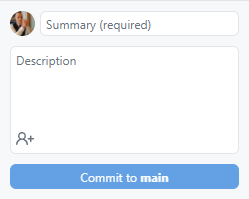
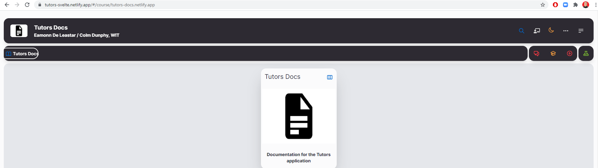

# Making Changes

1. For any change to take effect, you must open GitHub Desktop and enter a summary of your changes with an optional description.

2. Press `Commit to main`. This will push updates from your local machine, into staging, ready to be pushed into the remote repository.

    

3. Now select `Push origin` to synchronise your local and remote repositories.

    

4. Netlify will automatically update your website with the changes pushed to the remote repository.

5. Open your course site in a browser and refresh the page. This may take ~30 secs, hold the `Shift` key and refresh the page to clear the page cache.

    
You should now be able to experiment, using this guide to build your course as you like.
