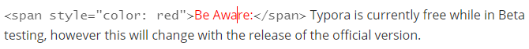

# About Typora

Be Aware: Typora is currently free while in Beta testing, however this will change with the release of the official version.

Typora adds additional functionality to the Markdown notation, such as highlighting, diagrams, maths, and emoji's. Unlike other editors, Typora is a Markdown only editor, meaning other files such as `properties.yaml` cannot be edited with this application.

However, Typora is unique, allowing the user to view how the content they are writing in Markdown will look through a browser, as they write it. This completely eliminates the time usually required for testing page formatting. 

  

To view the code which is in effect, just click the area which has been formatted. For example: `Be Aware` is red, click it to see the `` tag which is in effect.

  

