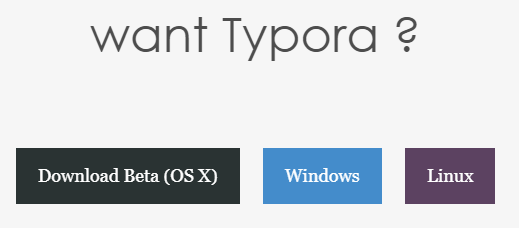
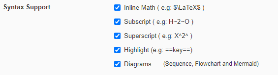

# Installation

Follow this link and select the operating system you are using:

- [Typora Download](https://typora.io/#download)

  

Install the application and launch it. 

Select `File` -> `Open Folder..`, then select the `tutors-starter` folder.  

You should see the folder structure open in the sidebar to the left. If the side bar is a list rather than a tree, select this option at the bottom of the sidebar.

  

Select `File` -> `Preferences`

Select `Markdown` from the options provided:

Enable each of the following options: 

