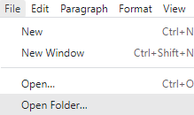
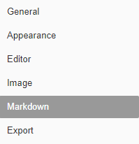

# Installation

1. Follow this link and select the operating system you are using:

   - [Typora Download](https://typora.io/#download)

     

2. Install the application and launch it. 

3. Select `File` -> `Open Folder..`, then select the `tutors-starter` folder.  

   

   

4. You should see the folder structure open in the sidebar to the left. If the side bar is a list rather than a tree, select this option at the bottom of the sidebar.

     

5. Select `File` -> `Preferences`

   

6. Select `Markdown` from the options provided:

   

   

7. Enable each of the following options: 

   

