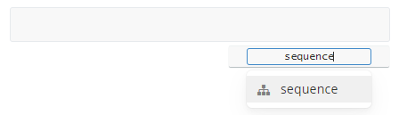

# Diagrams


1. To create a diagram, type "**```**". (The backticks, exclude the quotation marks.)

2. Press `Ènter` and notice the code block with a `Select a Language` box.

3. Enter the type of chart you want. For example: `flow` or `sequence`.

   

4. The instructions which build the chart can then be entered into the code block.


---


### Sequence Diagram

You can create `Sequence Diagrams`  by entering `sequence` as the diagram language:

(See [here](https://bramp.github.io/js-sequence-diagrams/#syntax) for a detailed syntax explanation)

```sequence
Alice->Bob: Hello Bob, how are you?
Note right of Bob: Bob thinks
Bob-->Alice: I am good thanks!
```


~~~
```
Alice->Bob: Hello Bob, how are you?
Note right of Bob: Bob thinks
Bob-->Alice: I am good thanks!
```
~~~


---


### Flowchart

You can create `Flowcharts` by entering `flow` as the diagram language:

(See [here](http://flowchart.js.org/) for a more detailed syntax explanation)

```flow
st=>start: Start
op=>operation: Your Operation
cond=>condition: Yes or No?
e=>end

st->op->cond
cond(yes)->e
cond(no)->op
```


~~~
```
st=>start: Start
op=>operation: Your Operation
cond=>condition: Yes or No?
e=>end

st->op->cond
cond(yes)->e
cond(no)->op
```
~~~


---

