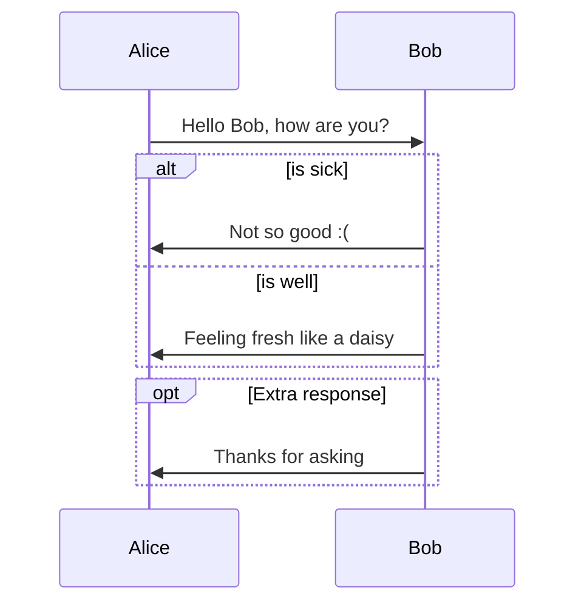
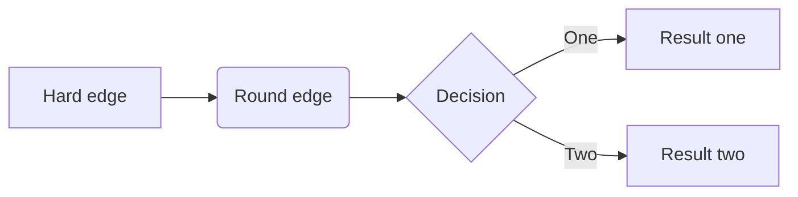
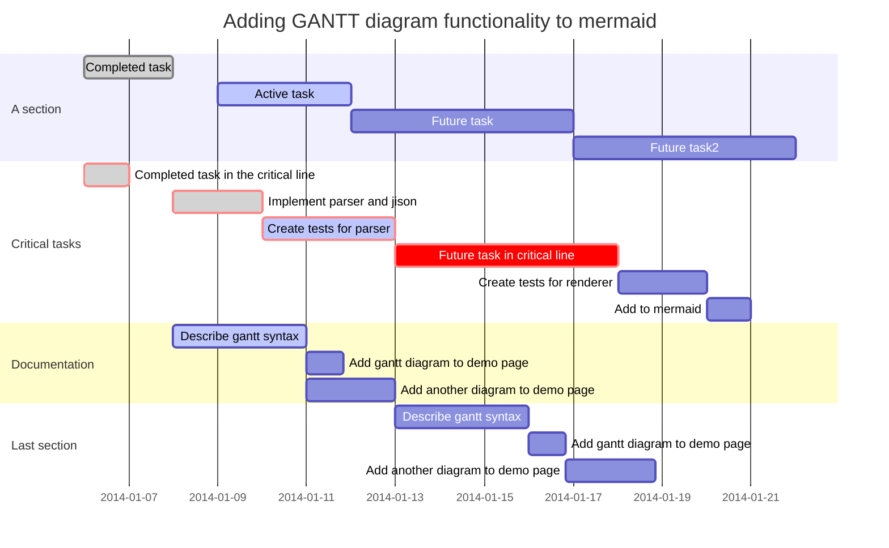
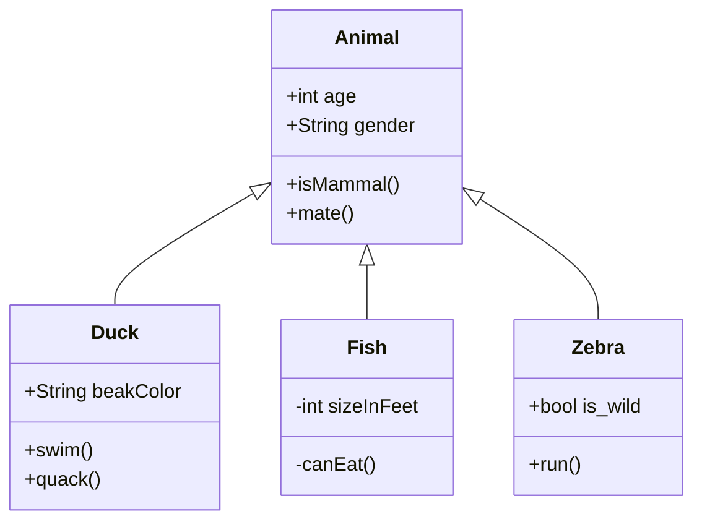
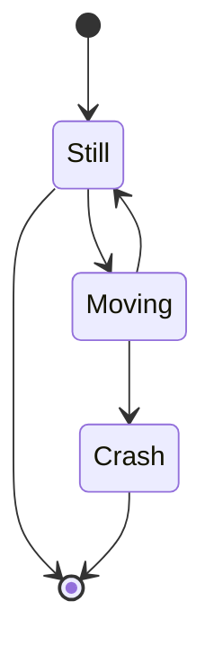
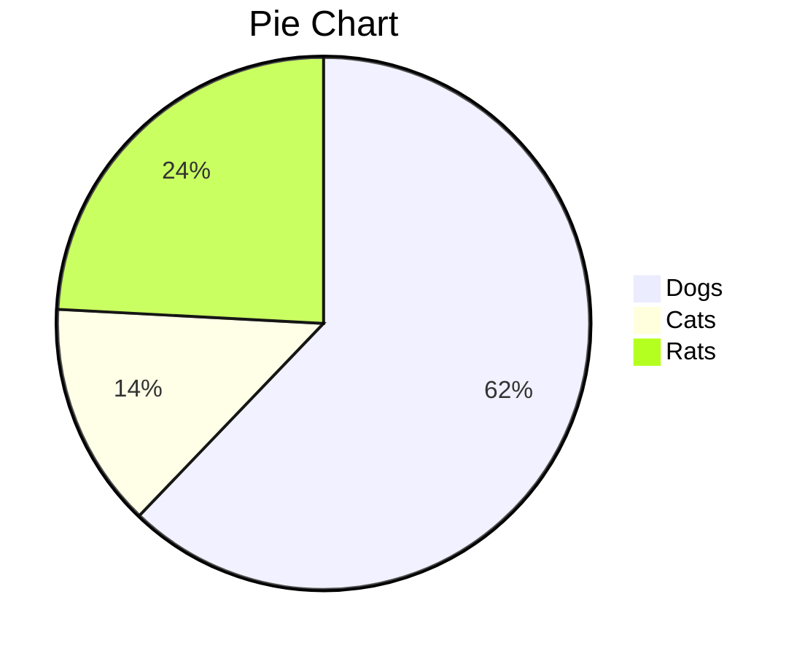

# Mermaid Charts


Typora has [Mermaid](https://mermaid-js.github.io/mermaid/#/) integration, allowing for more complex diagrams and charts:

(Enter `mermaid` as the chart language.)


### Sequence Diagram

- See [here](https://mermaid-js.github.io/mermaid/#/sequenceDiagram) for further instructions.



~~~
```
%% Example of sequence diagram
  sequenceDiagram
    Alice->>Bob: Hello Bob, how are you?
    alt is sick
    Bob->>Alice: Not so good :(
    else is well
    Bob->>Alice: Feeling fresh like a daisy
    end
    opt Extra response
    Bob->>Alice: Thanks for asking
    end
```
~~~


---


### Flowchart

- See [here](https://mermaid-js.github.io/mermaid/#/flowchart) for further instructions.



~~~
```
graph LR
A[Hard edge] -->B(Round edge)
    B --> C{Decision}
    C -->|One| D[Result one]
    C -->|Two| E[Result two]
```
~~~


---


### Gantt Charts

- See [here](https://mermaid-js.github.io/mermaid/#gantt) for further instructions.



~~~
```
%% Example with selection of syntaxes
        gantt
        dateFormat  YYYY-MM-DD
        title Adding GANTT diagram functionality to mermaid

        section A section
        Completed task            :done,    des1, 2014-01-06,2014-01-08
        Active task               :active,  des2, 2014-01-09, 3d
        Future task               :         des3, after des2, 5d
        Future task2               :         des4, after des3, 5d

        section Critical tasks
        Completed task in the critical line :crit, done, 2014-01-06,24h
        Implement parser and jison          :crit, done, after des1, 2d
        Create tests for parser             :crit, active, 3d
        Future task in critical line        :crit, 5d
        Create tests for renderer           :2d
        Add to mermaid                      :1d

        section Documentation
        Describe gantt syntax               :active, a1, after des1, 3d
        Add gantt diagram to demo page      :after a1  , 20h
        Add another diagram to demo page    :doc1, after a1  , 48h

        section Last section
        Describe gantt syntax               :after doc1, 3d
        Add gantt diagram to demo page      : 20h
        Add another diagram to demo page    : 48h
```
~~~


---


### Class Diagram

- See [here](https://mermaid-js.github.io/mermaid/#/classDiagram) for further instructions.



~~~
```
classDiagram
      Animal <|-- Duck
      Animal <|-- Fish
      Animal <|-- Zebra
      Animal : +int age
      Animal : +String gender
      Animal: +isMammal()
      Animal: +mate()
      class Duck{
          +String beakColor
          +swim()
          +quack()
      }
      class Fish{
          -int sizeInFeet
          -canEat()
      }
      class Zebra{
          +bool is_wild
          +run()
      }
```
~~~


---


### State Diagram

- See [here](https://mermaidjs.github.io/#/stateDiagram) for further instructions.



~~~
```
stateDiagram
    [*] --> Still
    Still --> [*]

    Still --> Moving
    Moving --> Still
    Moving --> Crash
    Crash --> [*]
```
~~~


---


### Pie Chart



~~~
```
pie
    title Pie Chart
    "Dogs" : 386
    "Cats" : 85
    "Rats" : 150 
```
~~~


